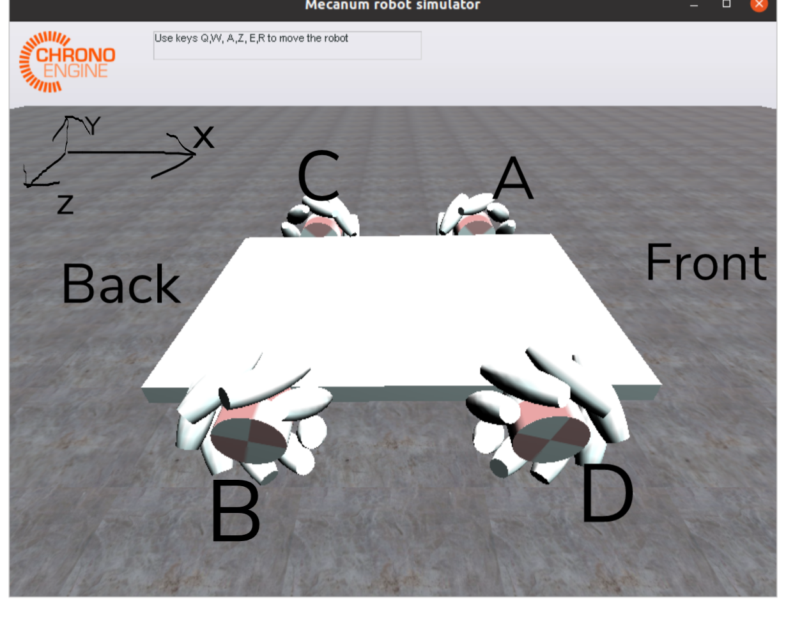

# Chrono_mecanum_model

## Update Notes

* 08/16: `demo_IRR_mecanum_3`, 4-wheel version, only 
* 08/21: `mecanum_GUI.cpp`, GUI version
  * Scrollbar: Not yet tested what value it parsed.
  * New speed: Should add some UI text to indicate current value


## Other Notes

Folder Structure: http://api.projectchrono.org/tutorial_install_project.html

### TODO

- [x] Specify front and back of the car. (Like take a screenshot of the car in the initial frame and label the wheel)
   
   
- [x] Find a way to specify [v1, v2, v3, v4] to each wheel
   - [x] Modify from code
   - [x] GUI?
   	* If we got GUI, task 2 "randomly chosse velocity combination" could be done here, as what we have in PyBullet
   	* There is several GUI demo in the demos/. e.g. demo_IRR_tracks

- [x] Dump trajectory to csv. For example, output something like

	```
	frame	x	y	z	angle(quarternion/xyz angle)
	1		...
	```
	
- [x] Visualize the dumped trajectory

- [ ] **Match ground truth data trajectory and plot**

   - The data already copied to current repo. 
      * [See data/README.md](data/README.md)
      * It is OK to use the not-cut data. There should not be huge difference
      
   - [ ] Tidy to the same format as GT state data 

      - [x] GT tidied data should be: xyz started at (0,0,0) [It already is? If I've got it right]
   
   - [ ] We might only needs xy and z_angle. z_angle is grabbed from quarternion to zyx euler angle, and then pick the first value.
   
   - [ ] **The car should head to y axis (Forward is Y axis, right handside should be X axis)** 
   
        
   
   - [ ] Timestep: We just need to make sure the total time are the same.
      * Real data: 60 fps, roughly 6s movement (as is stated in the CSG). Video might be longer. So usually there is roughly 360 informative frames.
      * Simulation data: It doesn't matter how large dt is as long as we are also simulating 6s data. e.g, dt=0.01s then we should simulate 600 timestaps.


